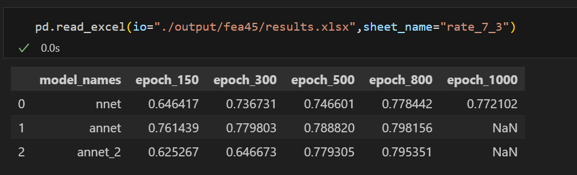
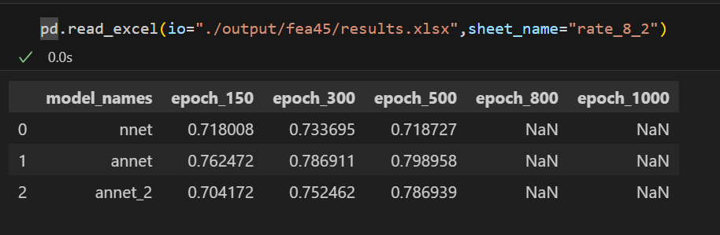

# medical-osssi

这里包含了 设计的三种 ANN 神经网络来预测 osssi 结局变量

|  | | |
|  ----  | ----  |----|
|   |  |  |

### 请按照下述过程将模型用于推理

- 安装 python，并使用下面的命令安装依赖

```bash
pip install -r requirement.lock.txt
```

- 执行下面的命令进行模型推理，`val_filepath` 参数指定验证数据集路径

```
python main.py --val_filepath="./data/val.xlsx" --save_filename="val"
```

最终的结果会输出到 `output` 路径下

### 目前的结果

目前模型对于 整个训练集的结果如下


