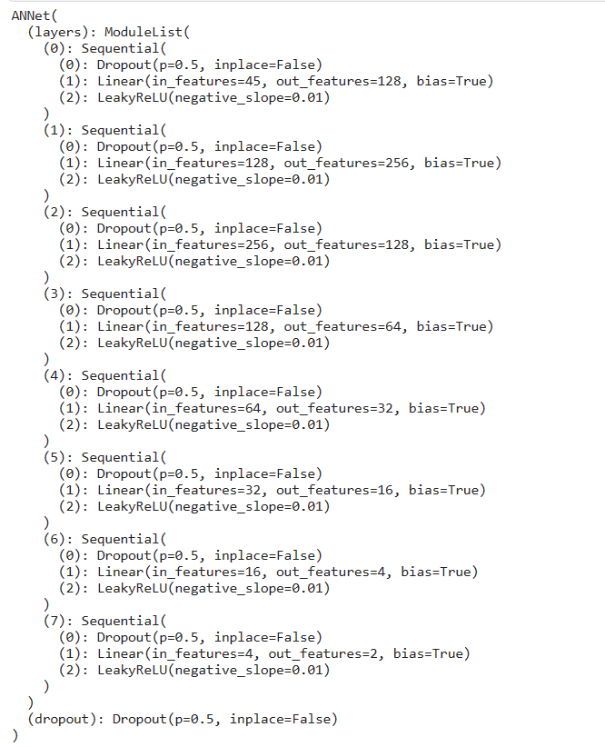
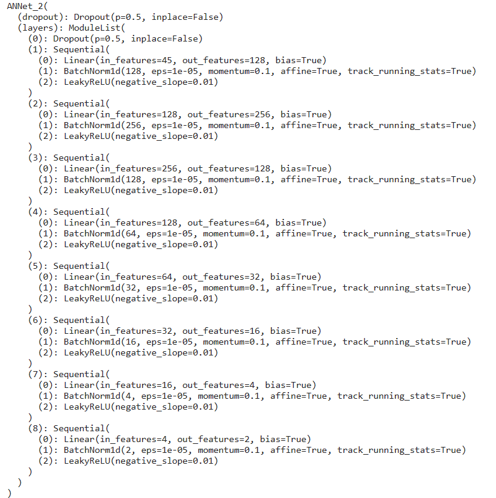
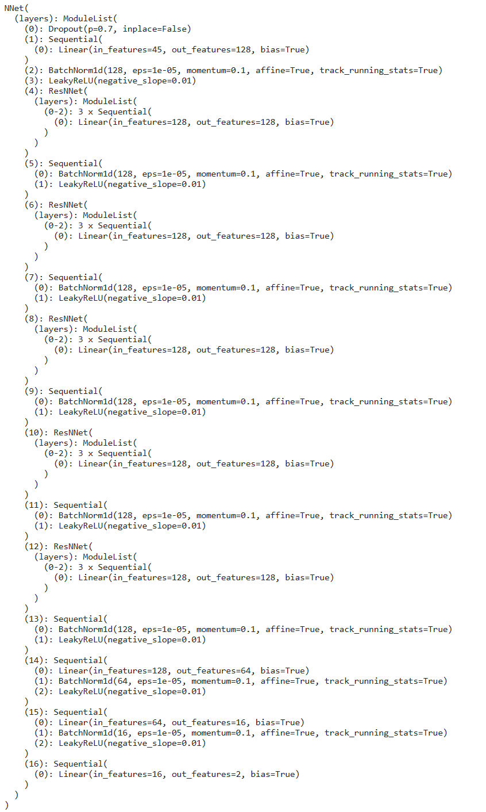

# medical-osssi

这里包含了 设计的三种 ANN 神经网络来预测 osssi 结局变量

|  | | |
|  ----  | ----  |----|
|   |  |  |

### 请按照下述过程将模型用于推理

- 安装 python，并使用下面的命令安装依赖

```bash
pip install -r requirement.lock.txt
```

- 执行下面的命令进行模型推理，`val_filepath` 参数指定验证数据集路径

```
python main.py --val_filepath="./data/validation1109.xlsx" --save_filename="ann-cnn1d"
python svc-rvc-lr-main.py --val_filepath="./data/validation1109.xlsx" --save_filename="svc-rvc-lr"
python nb-main.py --val_filepath="./data/validation1109.xlsx" --save_filename="nb"
```

最终的结果会输出到 `output` 路径下

### 目前的结果

|  method   | ROC  | MAX |
|  ----  | ----  | ---- |
| LG  | 0.732713 |
| SVC_Linear | 0.731084 |
| SVC_RBF | 0.724891 |
| RVC_Linear  | 0.736775 |
| RVC_RBF | 0.736900 |
| GLM | 0.733039 |
| Naive Bayes | 0.711904 |
| Naive Bayes (bins) | 0.713157 |
| ANN | 0.731309 |
| CNN1d-Fit | 0.759464 |
| CNN1d-Half | 0.762683 $\pm$ 0.007819 | 0.777190 |


